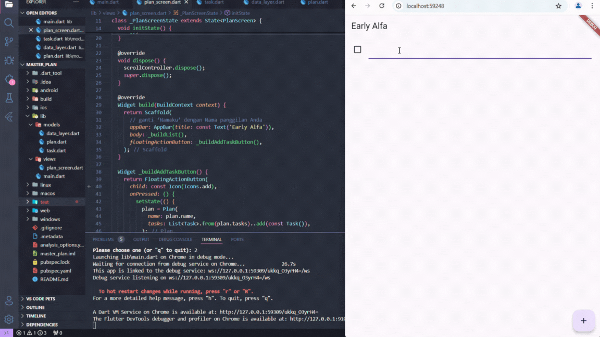
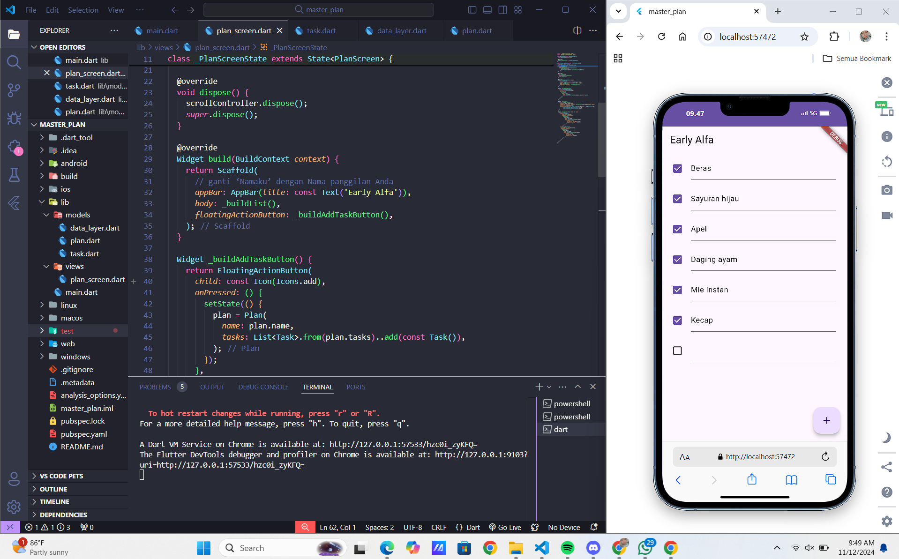
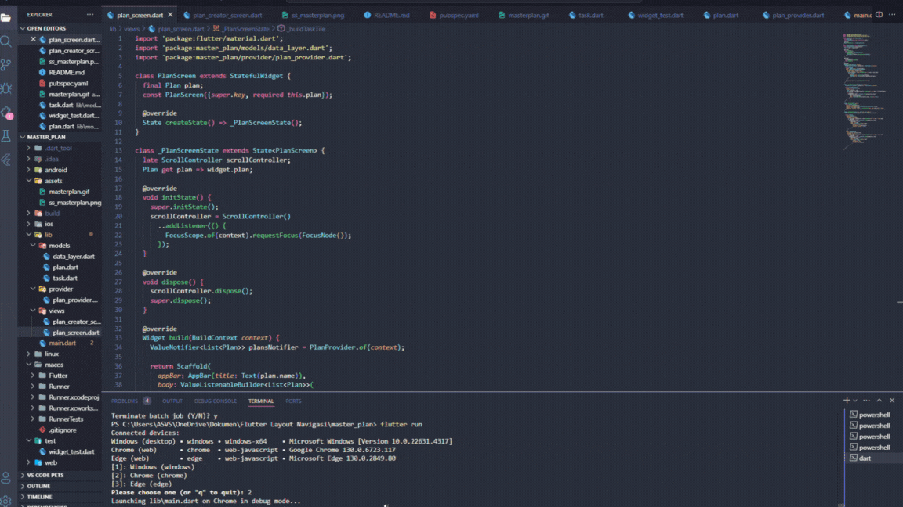

---

### Master_plan
**Nama**  : Early Alfa Sheilawati  
**NIM**   : 362358302105  
**Kelas** : 2D TRPL

---

## hasil projek praktikum 1
1. dokumentasikan berupa GIF hasil praktikum

2. Pada Langkah 4, membuat file data_layer.dart untuk menggabungkan semua model yang ada, yaitu task.dart dan plan.dart. Dengan menggunakan export, kita dapat dengan mudah mengimpor kedua model tersebut dalam file lain tanpa harus mengimpor satu per satu. Ini membuat struktur proyek menjadi lebih rapi dan modular. hanya perlu mengimpor file ini saja di seluruh aplikasi, sehingga tidak perlu mengelola impor model satu per satu di setiap file.

3. Variabel plan di langkah 6, digunakan untuk menyimpan data daftar rencana (Plan) yang berisi nama rencana dan daftar tugas. hanya data tugas yang diubah (seperti menambah atau mengubah deskripsi tugas), sementara data lainnya tetap konsisten.

4. Di Langkah 9, kita buat tampilan daftar tugas dengan widget ListTile. Tampilan ini memuat checkbox untuk menandai tugas selesai dan TextFormField untuk mengedit deskripsi tugas. Saat ada perubahan di daftar tugas (misalnya, tambah tugas, edit deskripsi, centang tugas), setState memperbarui tampilan berdasarkan data terbaru.

5.  Fungsi initState dan dispose pada Langkah 11 dan 13
    - Langkah 11 (Menambah Scroll Listener dengan initState): initState dijalankan pertama kali saat widget dibuat. Di sini, kita pakai ScrollController dengan listener agar ketika pengguna menggulir layar, fokus input otomatis hilang. Ini membantu tampilan lebih nyaman, terutama saat keyboard muncul.
    - Langkah 13 (Membersihkan scrollController dengan dispose): dispose berguna untuk membersihkan resource yang tidak lagi dipakai saat widget dihapus. Kita gunakan dispose untuk membuang scrollController agar tidak memakan memori lebih dari yang diperlukan.

---

## hasil projek praktikum 2

1. proses menambah tugas, mengedit deskripsi, dan menampilkan pesan kelengkapan tugas.

2. Langkah 1: Menjelaskan InheritedWidget dan Penggunaan InheritedNotifier
    - InheritedWidget adalah widget khusus di Flutter yang menyediakan akses data ke seluruh widget di bawahnya tanpa harus mengirim data secara manual ke setiap widget.
    - InheritedNotifier memungkinkan kita menggunakan ValueNotifier untuk mendengarkan perubahan data dan secara otomatis memberi tahu widget lain saat ada perubahan. Dengan begitu, kita bisa memperbarui UI tanpa memerlukan setState di setiap tempat yang menggunakan data Plan.

3. Langkah 3 Menambah Method completedCount dan completenessMessage: Kedua method ini membantu menghitung berapa tugas yang sudah selesai dan membuat pesan seperti "2 dari 5 tugas selesai" agar tampil di UI. Ini membuat tampilan lebih informatif bagi pengguna.

4. Menambahkan sesuatu di dalam projek
    - Langkah 11 (initState): Fungsi ini menyiapkan kontrol scroll ketika widget pertama kali dibuat. Saat pengguna menggulir daftar tugas, fokus pada TextField otomatis hilang, sehingga keyboard tidak muncul atau mengganggu tampilan.
    - Langkah 13 (dispose): Fungsi ini digunakan untuk membersihkan kontrol scroll ketika widget tidak digunakan lagi, membantu mencegah aplikasi menggunakan memori secara berlebihan

---

## hasil projek praktikum 3
